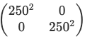
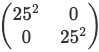
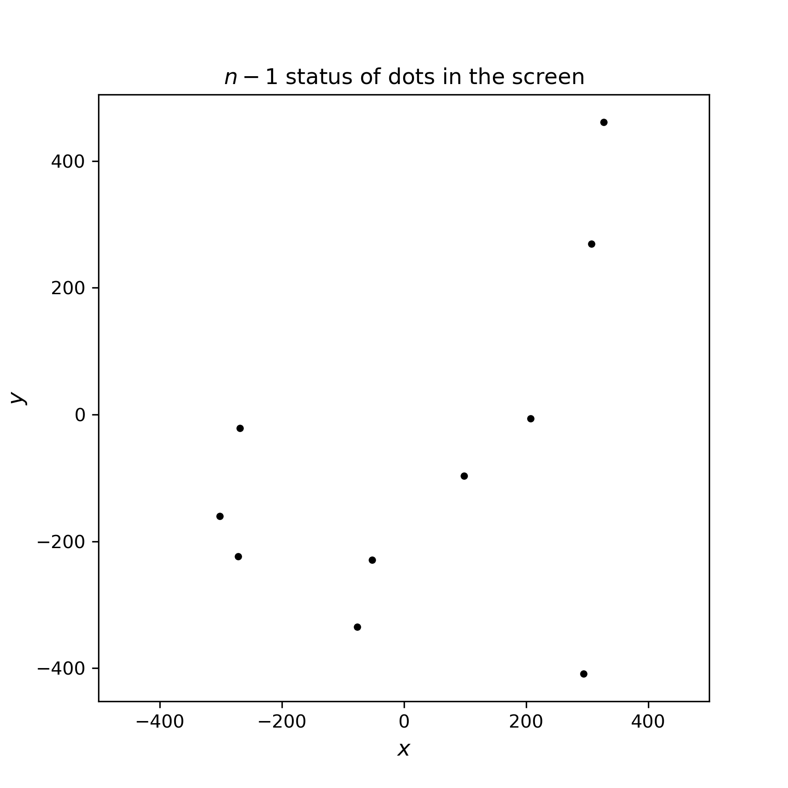
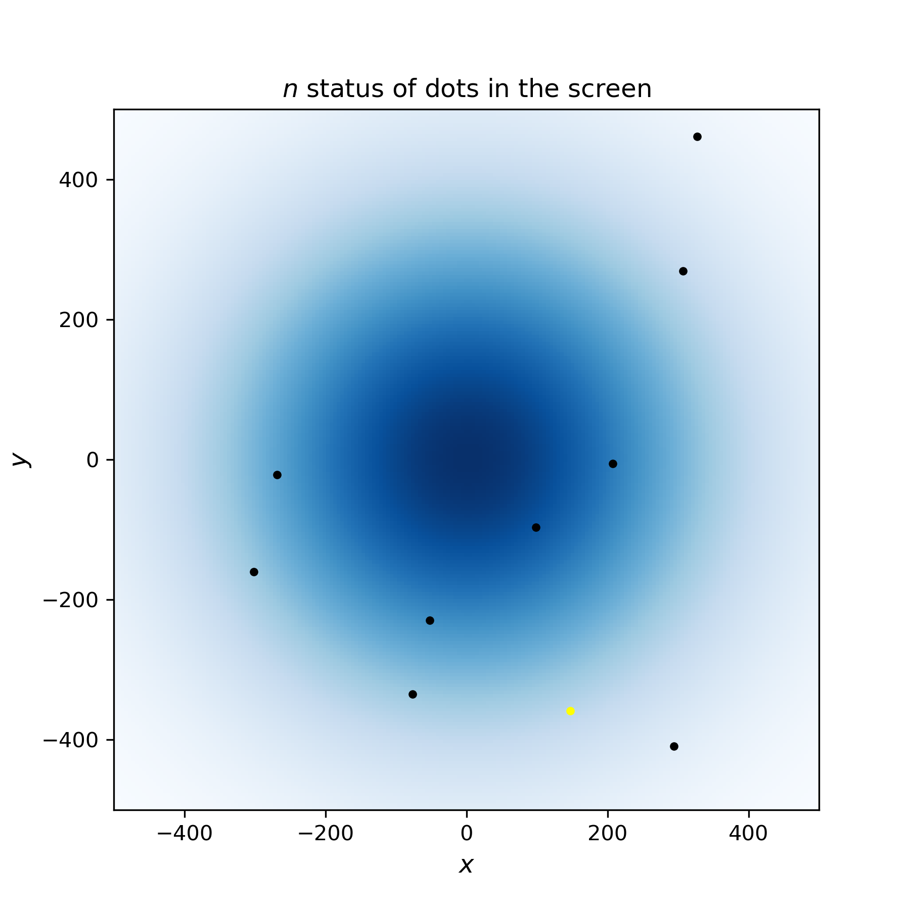
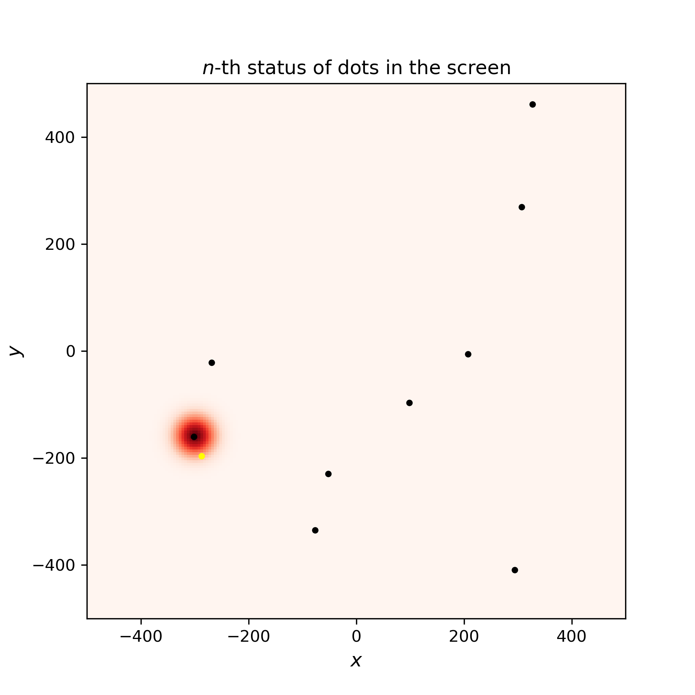

# marmoset_action_simulation

(NOT YET COMPLETED OF DESCRIPTIONS)
This repo is the code of the manuscripts, Hiroki Koda *et al* (Title or DOI will appear immediately after the journal acceptance), simulating the touch place of the marmoset action experiments.

## Requirements
- Python 3.6.7
- numpy 1.16.4

## Graphical descriptions of the model
In this model, the dots (marmoset touch location) were generated from several rules:

### 1. The first dot generations
The first dot is generated from the [bivariate Gaussian distributions](https://en.wikipedia.org/wiki/Multivariate_normal_distribution) with (0,0) as a mean parameter (&mu;g) and 
<!-- $
\begin{pmatrix}
250^{2} & 0 \\
0 & 250^{2} \\
\end{pmatrix}
$  -->
as a covariance matrix (&Sigma;g). This Gaussian distribution with large standard deviations(SD) is called as "**Global Process (GP)**", hereafter.

The heatmap of probability density of GP. The dot (yellow) is generated from the GP.
<!--  -->

### 2. The second dot generation
The next (second) dot is generated from each of GP **OR** the other bivariate Gaussian distribution of the mean parameter (&mu;l) set as the previous dot (grey dot in the next fig) and the covariance matrix (&Sigma;l) set as .
<!-- $\begin{pmatrix}
25^{2} & 0 \\
0 & 25^{2} \\
\end{pmatrix}
$ -->
The latter process aims to simulate the marmoset actions of touching the visible dot nearby. This Gaussian distribution with smaller SD is called as "**Local Process (LP)**", hereafter.

The second dot (yellow) is generated from the GP as well as the first dot (black), with the heatmap of the probability density of GP.

The second dot (yellow) is generated from the LP, determined by the first dot (black), with the heatmap of the probability density (red colorations) of LP.

### 3. n-th dot generations
Similar to the second dot generation, the n-th dot is generated from each of GP **OR** the LP. In the case of LP, the attend dot is chosen from the previous 10 dots (between n-1 th and n-10 th dots), and is set to the mean parameter of LP (&mu;l).

The sample figure of the n-1 th status of the screen. The 10 dots are shown.

The case of GP. The next (n-th) dot (yellow) is generated from the GP, with heatmap of the probability density of GP. 

The case of LP. The next (n-th) dot (yellow) is generated from the LP. The attend dot is the black dot, the center of the red area. Red area represent the probability density of the LP. 

## Flowchart of simulations

## Summary of parameters used in our simulations

- &mu;g = (0,0)
- &Sigma;g = 
<!-- \begin{pmatrix}
250^{2} & 0 \\
0 & 250^{2} \\
\end{pmatrix}
$ -->
- niteration = 10000
